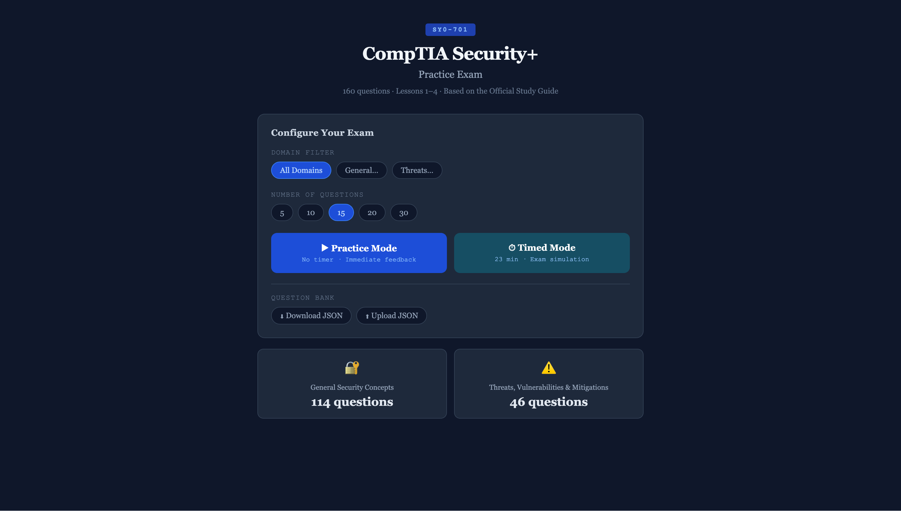

# CompTIA Security+ SY0-701 Practice Exam



> **⚠️ Disclaimer:** This was a vibe-coded app and the question content has **not been verified for accuracy**. Use it as a supplemental study tool, not as a definitive source of truth. Original questions were sourced from a friend's study materials; I adapted the project to run as a Cloudflare Worker.

**Live Demo:** [https://secplus.enderle-io.workers.dev/](https://secplus.enderle-io.workers.dev/)

A browser-based practice exam for the CompTIA Security+ (SY0-701) certification. Features 160 questions across two domains with configurable practice and timed exam modes — no backend required.

---

## Using the App

1. **Choose a domain** — Filter by *All Domains*, *General Security Concepts*, or *Threats, Vulnerabilities & Mitigations*.
2. **Set the number of questions** — Pick 5, 10, 15, 20, or 30 questions per session.
3. **Select a mode:**
   - **Practice Mode** — No timer; get immediate feedback after each answer.
   - **Timed Mode** — Simulates exam conditions with a countdown (~90 sec/question).
4. **Review results** — See your score and review missed questions at the end of each session.

### Manage the Question Bank

- **Download JSON** — Export the current question bank to a local file.
- **Upload JSON** — Replace the question bank with your own JSON file. Useful for adding new questions or corrections.

The JSON format for each question:

```json
{
  "id": 1,
  "domain": "General Security Concepts",
  "question": "What does CIA stand for in security?",
  "options": ["Confidentiality, Integrity, Availability", "..."],
  "correct": 0,
  "explanation": "The CIA triad is a foundational security model."
}
```

---

## Deploying to Cloudflare Workers

### Prerequisites

- [Node.js](https://nodejs.org/) (v18+)
- A [Cloudflare account](https://dash.cloudflare.com/sign-up)
- [Wrangler CLI](https://developers.cloudflare.com/workers/wrangler/)

```bash
npm install -g wrangler
```

### Steps

1. **Clone the repo**

   ```bash
   git clone https://github.com/MatthewEnderle/SecPlus.git
   cd SecPlus
   ```

2. **Authenticate with Cloudflare**

   ```bash
   wrangler login
   ```

3. **Prepare the public directory**

   Wrangler serves static assets from `./public` (see `wrangler.toml`). Copy the app files there:

   ```bash
   mkdir -p public
   cp index.html questions.json public/
   ```

4. **Deploy**

   ```bash
   wrangler deploy
   ```

   On first deploy, Wrangler will create the Worker in your Cloudflare account. Subsequent runs update it.

5. **Preview locally**

   ```bash
   wrangler dev
   ```

   Open [http://localhost:8787](http://localhost:8787) to test before deploying.

### wrangler.toml

The project is pre-configured for Cloudflare Workers static asset hosting:

```toml
name = "secplus"
compatibility_date = "2024-09-23"

[assets]
directory = "./public"
not_found_handling = "single-page-application"
```

Rename the Worker by changing the `name` field and re-deploying.

---

## Project Structure

```
.
├── index.html       # Single-page app (HTML/CSS/JS)
├── questions.json   # Question bank
├── wrangler.toml    # Cloudflare Workers config
└── cover.png        # Screenshot
```
